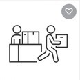
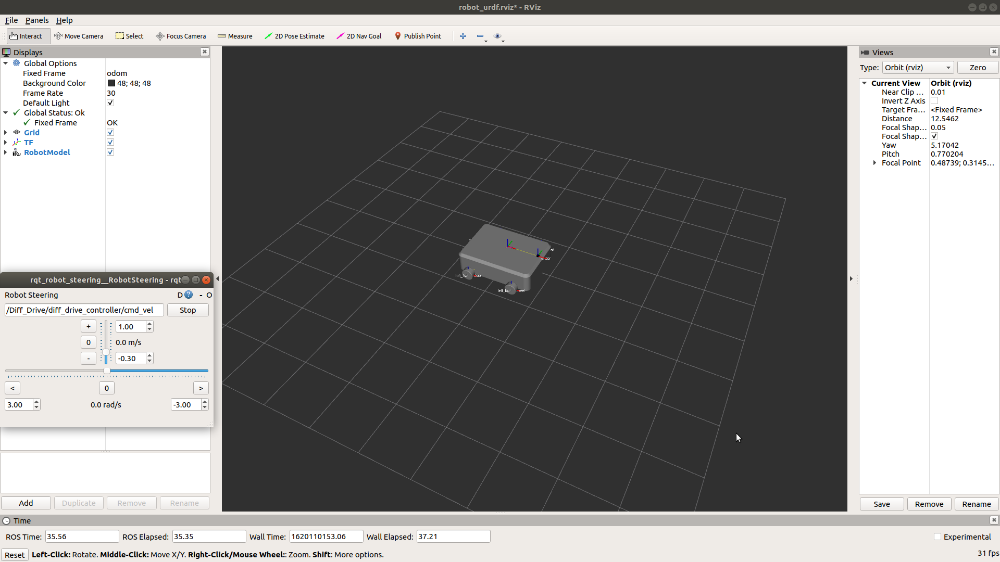
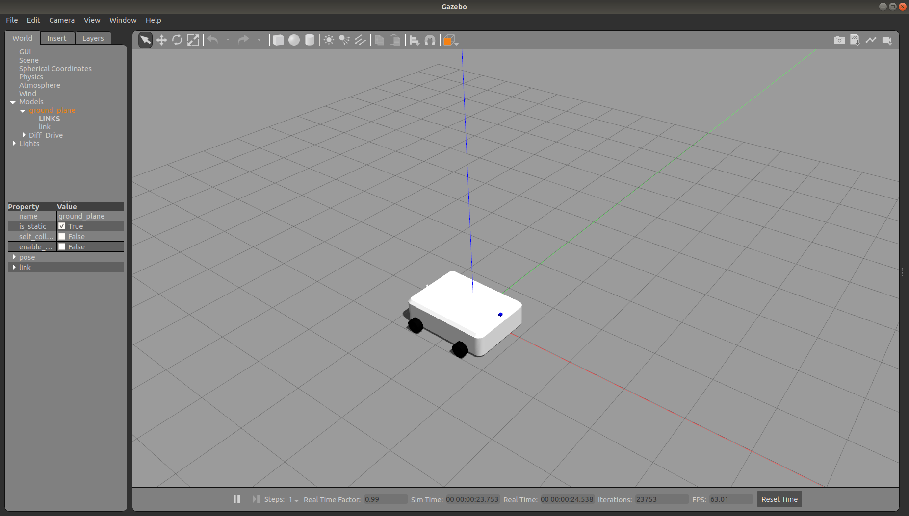
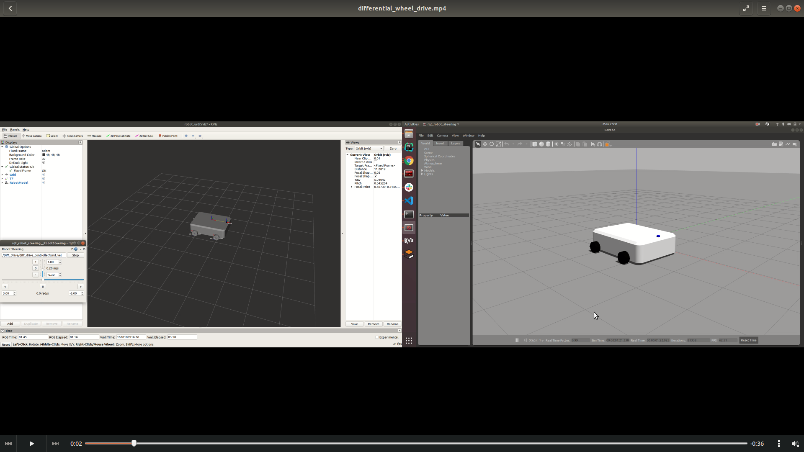
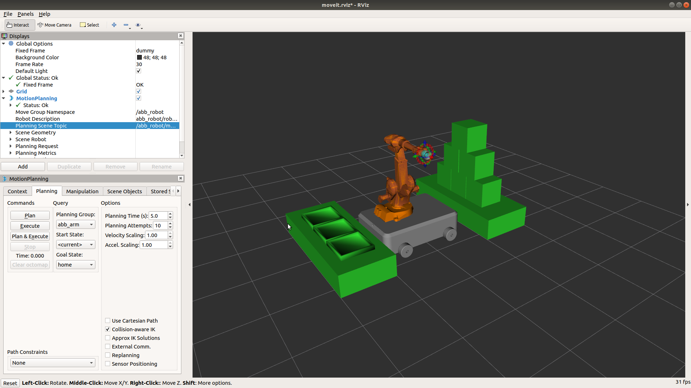
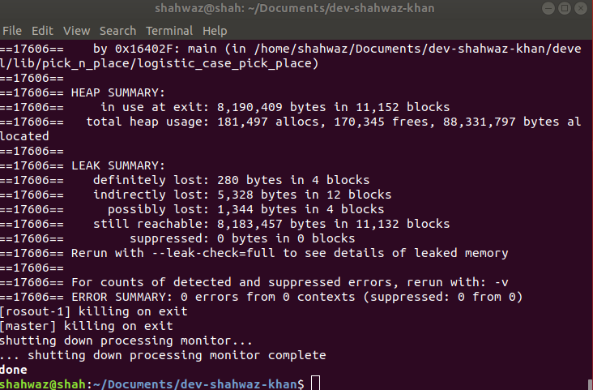

<!-- PROJECT LOGO -->

<p align="center">
  <a href="https://www.shutterstock.com/image-vector/collect-pick-order-icon-package-box-1879519894">
    
  </a>
</p>


<h3 align="center">Logistic Case Picking Operation</h3>


<!-- TABLE OF CONTENTS -->
<details open="open">
  <summary>Table of Contents</summary>
  <ol>
    <li>
      <a href="#about-the-project">About The Project</a>
      <ul>
        <li><a href="#built-with">Built With</a></li>
      </ul>
    </li>
    <li>
      <a href="#getting-started">Getting Started</a>
      <ul>
        <li><a href="#prerequisites">Prerequisites</a></li>
        <li><a href="#installation">Installation</a></li>
      </ul>
    </li>
    <li><a href="#build">Build</a></li>
    <li>
      <a href="#involved-components">Involved Components</a>
      <ul>
        <li><a href="#mobile-bot">Mobile Bot</a></li>
        <li><a href="#abb-robot-package">ABB Robot Package</a></li>
      </ul>
    </li>
    <li><a href="#Run">Run</a></li>
    <li><a href="#usage">Usage</a></li>
    <li><a href="#assumptions">Assumption</a></li>
    <li><a href="#error-handling">Error Handling</a></li>
    <li><a href="#implementation-issues">Implementation Issues</a></li>
   <li><a href="#memory-usage">Memory Usage</a></li>
    <li><a href="#contributing">Contributing</a></li>
    <li><a href="#license">License</a></li>
    <li><a href="#contact">Contact</a></li>

  </ol>
</details>


<!-- ABOUT THE PROJECT -->

## About The Project

The aim of the project is to design a realistic solution to a pick a box from a mountain of arranged boxes and place the
box onto its corresponding container. Each container has a different visual marker (bar-code, QR Code, etc.), and each
box has he same marker as the container it should go to. The distance between the mountain of boxes and the containers
is 10m. The boxes weight between 10 and 15kg and their size between 30x30x30 cm and 50x50x50cm, but they are not
necessarily equilateral. The mountain of boxes is not higher than 1.5m.

The project involve three deliverable :

- Description of the solution and summary of its workflow
- Details of the components and plan for the implementation of the solution
- Source code of one of the components

The relevant README files for the above two deliverables are :

1. deliverable - 1  [README](src/pick_n_place/deliverables/first_deliverable/README.md)

2. deliverable - 2  [README](src/pick_n_place/deliverables/second_deliverable/README.md)

### Built With

The project is made using the following framework and hardware:

* [ROS](https://www.ros.org/)

* [C++](https://www.cplusplus.com/)

* [MoveIt](https://moveit.ros.org/)

* [ABB Support Package](https://github.com/ros-industrial/abb.git)

* [Mobile Base](src/mobile_bot)

<!-- GETTING STARTED -->

## Getting Started

To get started with the project, you need to have the following prerequisites installed in your system.

### Prerequisites

* ROS

The ROS (Robot Operating System) is a free software, sourced and maintained by
[Open Robotics](https://www.openrobotics.org/). You must have ROS in order to run this project on your system Follow all
the instructions to [install ROS Melodic](http://wiki.ros.org/melodic/Installation), including calls to `rosdep`.

* MoveIt

MoveIt is an open source project that is the result of the combined efforts of a large international community and
multiple organizations. To Install on Ubuntu 18.04:

        sudo apt install ros-melodic-moveit

You can also follow the official [MoveIt website](https://moveit.ros.org/) to know more about it.

### Installation

1. Clone the repo

  ```sh
  git clone https://shahwazk@bitbucket.org/telexistence/dev-shahwaz-khan.git
  ```

<!-- USAGE EXAMPLES -->

## Build

Once you have all the necessary files and hardware arranged, you can build your project.

```sh
cd your_project_directory
catkin_make
```

In order to save processing power, you can also use:

```sh
catkin_make -j7
```

Here, 7 denotes the number of cores you want to assign during make process. You can assign however amount of cores.

<!-- COMPONENTS USED -->

## Involved Components

The two important components involved in this project.

### Mobile Base

Mobile base and ABB IRB2400 Industrial robot. The mobile base is a carrier for the ABB robot is the primary mode of
transportation of Robot from pick place to place position. The base has a payload capacity of 3000lbs and can easily
lift the robot, accompanying power source and weight of the boxes.

The mobile is a four wheel differential drive system and uses a custom package made of SolidWorks designs, URDFs and
differential controllers for left and right back wheels.

To launch the robot on RVIZ and Gazebo,

```sh
source your catkin directory

roslaunch mobilebot_launch diff_drive.launch
```

The corresponding windows that open on RViz and Gazebo along with rqt_steering can be seen in the images below.The
working of the differential wheel drive can also be seen in the video.

### Images

<p align="center">
  <a href="https://drive.google.com/file/d/1e1KW6Z8X4mplqPg4JuSg7ZqsprAp57db/view?usp=sharing">
    
  </a>
</p>

##

<p align="center">
  <a href="https://drive.google.com/file/d/1Tj8ectDukG06Gy1YywKBGDEnCmVcy4gh/view?usp=sharing">
    
  </a>
</p>

##

### Video

The working of the differential wheel drive can be visualized on both RViz and Gazebo from the video below:

<p align="center">
  <a href="https://youtu.be/Yc0dbEhL2GY">
    
  </a>
</p>

###

### ABB IRB2600 Robot

The ABB robot is a 6 DOF Industrial arm its main task to pick the boxes that can range from 10 -15 kg and place it onto
the corresponding containers. This robot has a payload capacity of 20kg and thus can easily lift the boxes.


<!-- ROADMAP -->

## Run

After building the project, the project can be run for the pick and place operation performed on RViz using MoveIt
visualization

```sh
roslaunch pick_n_place robot_planning.launch
```

## Usage

Check out the video to visualize the complete pick and place operation performed by ABB IRB2600 robot mounted over a
mobile base. In the video, it can observed that the robot will successfully complete the pick and place operation for
three robots and then will move to the home position.

<p align="center">
  <a href="https://youtu.be/TcJz3IKLtSs" target="_blank"></a>

</p>

<!-- ASSUMPTIONS -->

## Assumptions

The following are the assumptions that were taken into account when designing the pick and place operation for the ABB
IRB2400 robot and mobile base:

1. The shape of the boxes is assumed to be cube with a dimension of 50cm.


2. The pick and place are at equal distance from the chassis link of the mobile base.

<!-- ERROR HANDLING -->

## Error Handling

The code is designed in such a way that it can handle few error that can be thrown during the execution of the actual
pick and place operation by the robot.

1. System gracefully handles the case when QRCodeScanner fails to read the QR. In such scenarios,System retries it for
   x (which is 3 right now) times. This is implemented using Custom exception handling.


2. System has been configured to retry planning x (which is 3 right now) times using built in planning attempt provided
   by RRTConnect library.


3. System immediately exists if two containers with the same QR code were found.


4. System immediately exists if a container with matching box QR code is not found.

<!-- IMPLEMENTATION ISSUES -->

## Implementation Issues:

While designing the system and visualizing the pick and place operation, following issues were faced:

1. Although, the differential wheel drive of the mobile base works independently as evident from the video above, the
   integration of differential drive with the robot planning doesn't seem to work. Because of this issue, the problem
   has been designed for limited containers(3) due to the reachability issue faced by the robot.


2. The visualization of the pick and place operation in the MoveIt seem to show only the planning path and the actual
   robot do not follow the planning path or sometime it does and stops in halfway through. One solution to that is to
   manufally update the planning scene topic regularly between two available topics on RViz:

         -/abb_robot/move_group/monitored_planning_scene
   
         -/abb_robot/planning_scene

<!-- MEMORY USAGE -->

## Memory Usage

To check the memory usage - for `HEAP MEMORY` and `LEAK MEMORY`, following command can be added to the `roslaunch`
of the launching node - `launch-prefix="valgrind ."` If your system do not have `valgrind` installed, you can do so by
running the following command on terminal -

a. Make sure to install valgrind

      sudo apt-get install valgrind

b. Remove any old Valgrind logs:

      rm valgrind.log*

c. Start the program under control of memcheck:

      G_SLICE=always-malloc G_DEBUG=gc-friendly  valgrind -v --tool=memcheck --leak-check=full --num-callers=40 --log-file=valgrind.log $(which <program>) <arguments>

After successfully installing the Valgrind, modify the node logistic_pick_place
under `src/pick_n_place/launch/robot_planning.launch`
to the following:

      <node name="abb_robot_planning"  pkg="pick_n_place" type="logistic_case_pick_place" output="screen"  launch-prefix="valgrind "/>

The output of the following changes will results in the following result of the pick and place operation :


<p align="center">
  <a href="https://drive.google.com/file/d/1R5xt86QNm7jANW2EA5pHh6iew51hqPRm/view?usp=sharing">
    
  </a>
</p>

<!-- CONTRIBUTING -->

## Contributing

Contributions are what make the open source community such an amazing place to be learn, inspire, and create. Any
contributions you make are **greatly appreciated**.

1. Fork the Project
2. Create your Feature Branch (`git checkout -b feature/AmazingFeature`)
3. Commit your Changes (`git commit -m 'Add some AmazingFeature'`)
4. Push to the Branch (`git push origin feature/AmazingFeature`)
5. Open a Pull Request

<!-- LICENSE -->

## License

Distributed under the MIT License. See `LICENSE` for more information.

<!-- CONTACT -->

## Contact

Your Name - [Shahwaz Khan](https://github.com/sshaizkhan)

Project Link:  [Logistic Case Picking](https://shahwazk@bitbucket.org/telexistence/dev-shahwaz-khan.git)
