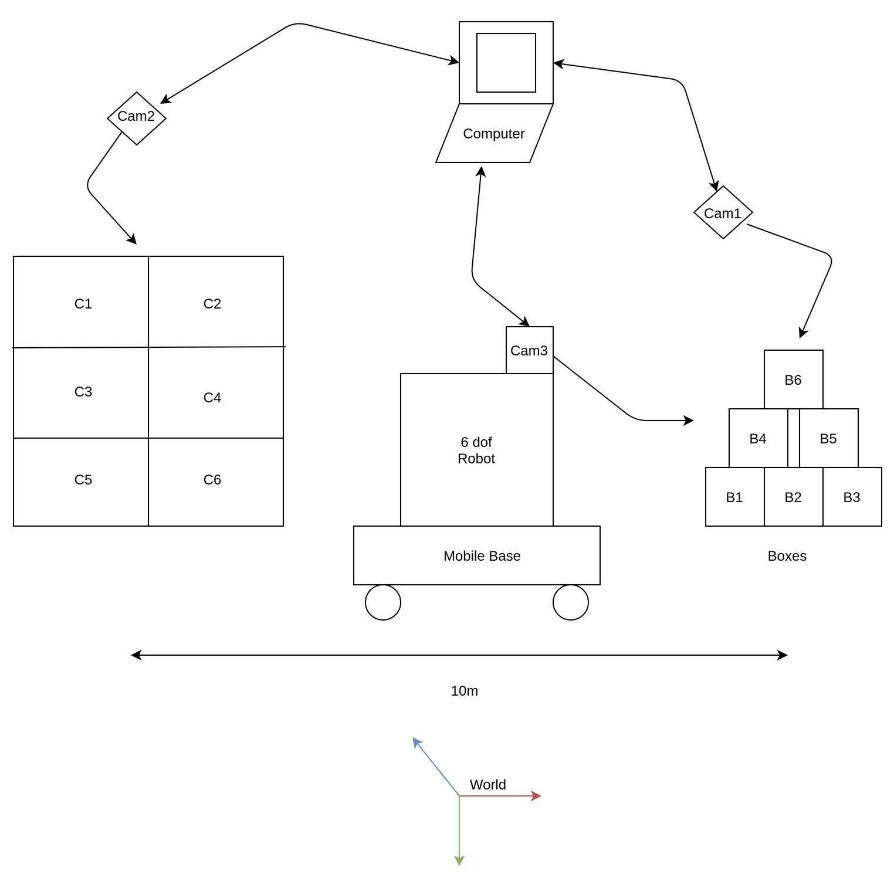

# **LOGISTIC CASE PICKING**

# _FIRST DELIVERABLE_

## System Description and Solution

The given problem statement is a classic automatic pick and place situation where a robot has to pick an object from
position **P** and drop it on another position **D**. In most of the cases, the robot is always fixed in one position
and the picks and place the objects on either side relative to the robot's position.

**_Robot and Mobile Base :_**

The novel idea behind this problem is that the place position is at some distance **X** from the pick position and that
will introduce new factor - _a mobile base_ for the robot to be placed upon. The mobile base should be able to carry the
load of the robot plus the lifted object and should have basic functionality to properly translate within the workspace
of the pick and place environment (world). The selection of the robot is also important as it should have enough
workspace to be able to reach the outermost and the top most area around the heap of boxes arranged in the mountain
fashion.

**_Camera(s) :_**

The system should also comprises of camera(s) to read and match the barcodes on the boxes and bins respectively. The
camera(s) should also be able to localise the position of the boxes and bins in the pick and place world.

**_End Effector :_**

Also, in order to lift the boxes, the robot should be fitted with an vacuum operated end effector, that can be lift the
payload of capacity ranging between 10 - 15 kg. The end effector should be easy to install and control and shouldn't add
any complexity to the system.

## System - Block Diagram

In order to understand the system, a block diagram of the system is presented below.

The abbreviation can be explained as follows:
 
a. _Boxes_ : B1, B1, . . . . . . . . . , B6, can be expressed as b i .

b. _Container_ : C1, C2, . . . . . . . , C6, can be expressed as c i .

c. _Camera(s)_ : Cam1, Cam2, Cam3, depth perception cameras .

## Work process flowchart

The process workflow chart for the following system can be broadly described as shown in the 
flowchart below.

