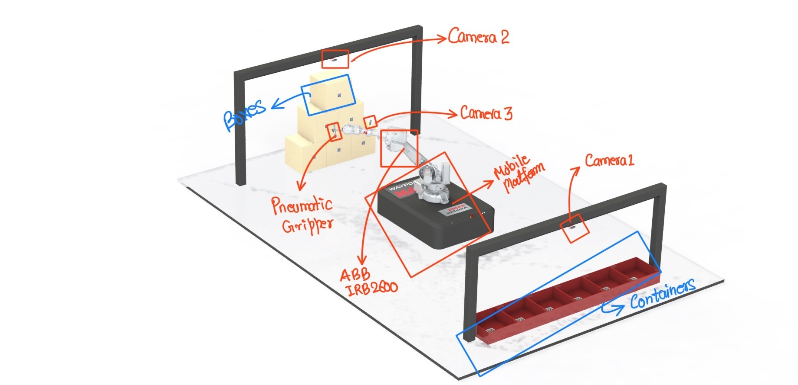
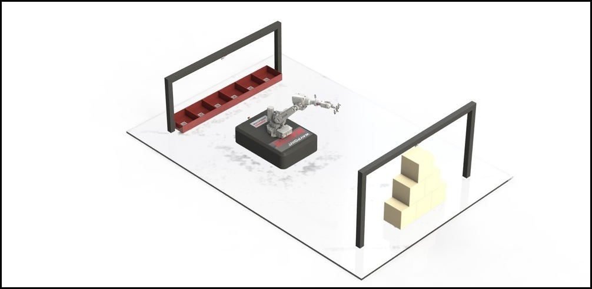

# LOGISTICS CASE PICKING

## SECOND DELIVERABLE
# 
### Components Detail

This deliverable is based on the solution presented in the first deliverable. The deliverable consists of brief summary 
of the components and technologies that are used in order to present a solution to the given logistic case picking problem.

Therefore, the various components used as are follows:

* **6 dof Robotic Manipulator**: The selection of the manipulator was based on its reachability and payload capacity. The manipulator 
  should be able to reach a height of 1.5m withing its workspace and carry load between 10 - 15 kg. Based on the given conditions, 
  **_ABB IBR2400 and IBR2600_** would be best suitable for this task. It has reach of 1.55 - 1.85 respectively with load carrying capacity
  from 12 - 20 kg. To read more on this, please [click here.](https://new.abb.com/products/robotics/industrial-robots/robot-selector)
  

* **Mobile Platform**: Traditionally, the pick and place position are within the workspace of the robotic manipulator but in this problem, having
  a distance of 10m between pick and place position, warrants a mobile platform. The platform should be such that it can carry
  the combined load of manipulator and box, and should be easy to integrate with current system. Based on the formulated conditions,
  **_MAV3K Autonomous Mobile Robot_** by **WAYPOINT ROBOTICS** would be right fit. The platform can carry upto 3000lbs load and has built in LIDAR and ROS-native system architecture.
  To read more this, please [click here.](https://waypointrobotics.com/mav3k-autonomous-mobile-platform/)
  

* **Camera(s)**: Camera plays a important role in an automated material handling environment it can be used to scan items, 
  QR Codes, raw data for object detection and much more. In the given problem, the system consists of three cameras. First
  camera mounted on top of boxes (2m high) for the pose estimation, second camera mounted on top of containers (1.5m high) 
  for scanning and sending QR code of containers to the system and the third camera mounted on robot to scan the QR codes 
  on the box and then send it over to the system for registration and matching with the QR codes of the respective containers. 
  For this purpose, we use industrial cameras which has higher resolution at larger distance like as in our case, so 
  **_COGNEX In-Sight 2000 Vision Sensor_** can accomplish the task. To read more on this, please 
  [click here.](https://www.cognex.com/products/machine-vision/vision-sensors/in-sight-2000-vision-sensors)
  

* **End Effector - Pneumatic Gripper**: The need of pneumatic gripper has been increasing lately because of their versatility 
  ease of use. The pneumatic gripper consists of rubber bellows and are operated using vacuum pressure. Nowadays, multiple 
  bellows are combined together to form a single giant gripper in order to lift heavy load. The high negative pressure is usually
  created using vacuum generator which uses highly compressed air to create a partial vacuum under the bellows to lift the items.
  For this task, four bellows above 6cm diameter and a pressure of roughly 12kPa can easily lift 15kg payload.
  
### CAD Model Assembly for the proposed system

### 
### Implementation of Proposed Solution

The implementation of the solution is based on the process flowchart presented in the first deliverable. The implementation will
follow the exact flow with more details clubbed with the type of library or technology it will use or has to be developed for successful implementation.
_____________________________________________________________________
* #### OS and COMMUNICATION:
  
  To get started with the assignment, the computer system must have Linux installed with ROS Kinetic or higher version. 
  The use of ROS will make it easier to integrate the hardware with software for an easier communication. ROS can communicated with other ROS system via TCP/IP protocol 
  which makes it easier to command the robot, cameras and other hardware to perform certain actions and to get raw data as well.
#### 

*  **Library Used** :

        TCP/IP Protocol : The Custom TCP/IP protocol might need to be developed
____
____

* #### LOCALIZATION:

    The term "_localization_" means to define the pose (**_translation and orientation_**) of the environment variables located 
    in the system. To following equations will further explain the term.
  
  * Any place in the system selected as Static Frame of the world.
  * **Robot Localization** : To simply the problem, the home position of the robot is situated at the world frame.
  
                                        [ 1 0 0 0 ]
                          wTr    =      [ 0 1 0 0 ]
                                        [ 0 0 1 0 ]
                                        [ 0 0 0 1 ]
    
    Here, _aTb_ represents, transformation matrix of **b** w.r.t **a**  
####

  * **Camera Localization ( Cam 1 & Cam 2)** :
    * Fixed Camera positions
    * Fixed transformation
    * No need for the transformation of Cam 3
####

  * **Box localization** : 
    * The transformation of box bi w.r.t camera 1 is known, c1**T**bi, hence the transformation of box w.r.t. world:
      
                          wTbi = wTc1 x c1Tbi
####

  * **Container localization** : 
    * Similar transformation for container and camera 2 can be written as: 
      
                          wTci = wTc2 x c2Tci
####  
  This concludes the localization of the unknown objects in the system w.r.t. to a single world frame. Now the system is
  aware of the pose of each and every variable in the work environment.
####

* **Library Used** :

        EIGEN3: eigen3 library is availabe for both C++ and Python
___
___
  
* #### Robot Path Planning: 

    After successful localization of the system variables, the robot can move to a safe location close to the mountain of boxes. 
    This position is provided by camera 1 located on top of the boxes and is sent to the system, which through TCP/IP protocol, transfer
    the location to the robot controller. The complete assembly of robot + mobile base can be considered as one single unit - robotic manipulator. 
    The path taken by the robotic manipulator will depend on what type of planning algorithm 
    has been implemented. The following algorithm are most popular for path planning : 
  
   * RRT
     
   * AStar
     
   * RRTStar
  
  ####
  **NOTE:** : While moving from world position to the position close to the boxes, the path planning is implemented on mobile base
              and not on the ABB robot.

*  **Library Used** :
Given the URDF file of the mobile base and the robot:

        MoveIt : MoveIt will generate the config package with selected path planner
        OpenCV : For pose estimation of the boxes by Camera 2
_________________________________________________________________________________________

  

   

  

